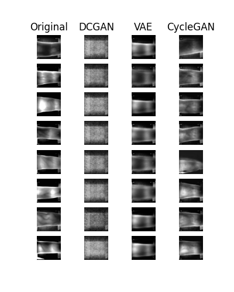

# VeinGAN
> Synthetic Image Generation of Veins using Generative Models

[](https://colab.research.google.com/drive/1-GCMNedTP3j0v8AhIl7Rg3qGMDB-9lj7?usp=sharing)



### Usage

#### Requirements
Use this script to install the requirements for this implementation.

```python
pip install -r requirements.txt
```

#### Download Dataset
To download the dataset locally, use this script as follows.
```python
python -m scripts.download --dataset=<dataset> --target=<target>
```

Parameter
- `dataset`: A Kaggle Dataset Name or Key
  - `kaggle-fv`: Kaggle Finger Vein Dataset (Default)
- `target`: Target Directory for Dataset (Default: ./veingan-tmp/dataset/)


#### Generate Images
To train the model and generate synthetic images, use the following command and adjust the given parameters.

```python
python -m scripts.generate <model> <dataset> <target> --verbose --epoch=<epoch> --configuration=<configuration>
```

Parameter
- `model`: The GAN model to generate the image- 
  - `gan`: Deep Convolutional GAN
  - `vae`: Variational Autoencoders
  - `cyclegan`: CycleGAN
- `dataset`: The dataset to train on
- `target`: The target directory to save the images
- `verbose`: Argument to enable verbose output of model progress
- `epoch`: The amount of cycle to train on
- `configuration`: Configuration Specifc for Model
  - `vae_128+cpu`: VAE CPU Mode (Default)
  - `vae_128+gpu`: VAE GPU Mode
  - `gan128_64+cpu`: GAN CPU Mode (Default)
  - `gan128_64+gpu`: GAN GPU Mode
  - `gan128_64+full`: GAN GPU Mode with (Full Train)
  - `cyclegan128_1+cpu+train`: CycleGAN CPU Mode (Default)
  - `cyclegan128_1+gpu+train`: CycleGAN GPU Mode
  - `cyclegan128_1+full+train`: CycleGAN GPU Mode (Full Train)
  - `cyclegan128_1+infer`: CycleGAN Inference Mode


#### Evaluate Result
Evaluate some sample of the dataset using various methods.

```python
python -m scripts.evaluate <method> <target> --configuration=<configuration>
```

Parameter
- `method`  Method of Evaluation
  - `entropy`: Calculates Entropy of Sample Sets
  - `laplace`: Calculates Laplace Gradient of Sample Sets
  - `inception`: Calculates Inception Score of Sample Sets
  - `snapshot`: Preview a snapshot of Sample Sets
- `target` : Target Directory and Label of Evaluation Sets (Example: "dir:label;dir:label")
- `configuration` : Specific Configuration for Evaluation Method


### Authors
- Abhishta Gatya Adyatma [Email](mailto:abhishtagatya@yahoo.com)
- Francisco Colino [Email](mailto:xcolino@stud.fit.vutbr.cz)
